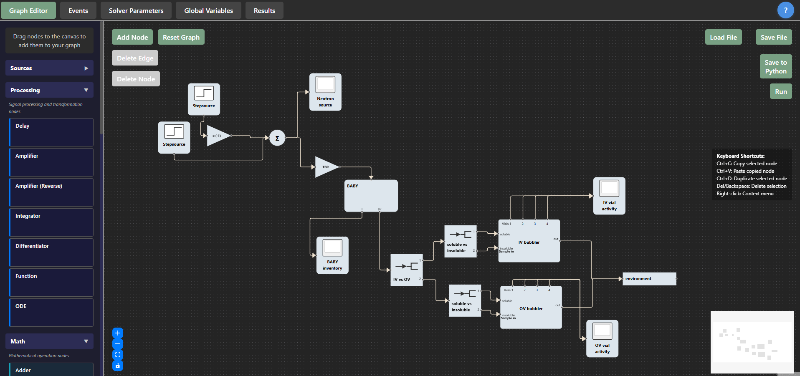
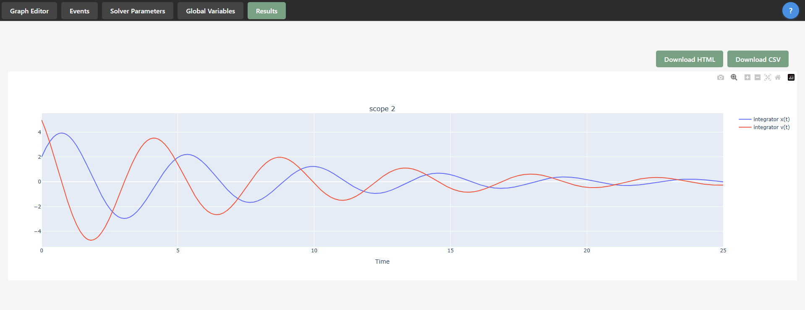

# Summary

`PathView` is an interactive, browser-based graphical interface for the system simulation framework `PathSim` [@Rother2025]. It enables users to build models quickly in an intuitive, visual environment. Built with `ReactFlow` [@reactflow], `PathView` allows users to:

- Drag and drop simulation nodes onto a canvas.
- Connect nodes to define system structure.
- Create and manage subsystems for hierarchical modelling.
- Configure event detection and advanced simulation options.
- Configure solver parameters
- Easily extend functionality through a modular architecture.

In addition to mirroring nearly all of `PathSim`'s capabilities, `PathView` uses `Jinja2` templates to generate fully executable Python scripts from graphical models, enabling seamless transition between GUI-based and code-based workflows.

# Statement of need

`PathSim` is a powerful and flexible simulation framework for modelling complex systems. However, building large-scale or intricate models solely through Python scripting can be cumbersome and error-prone, particularly for new users or for projects that benefit from visual inspection of system layout.
Many established simulation platforms, such as MathWorks Simulink [@simulink] or Aspen Plus [@aspen], provide graphical user interfaces to enhance usability, model comprehension, and collaboration. Until now, such a visual modelling environment was missing for `PathSim`.
`PathView` fills this gap by providing a modern, interactive, and extensible GUI, reducing the barrier to entry for new users and improving productivity for experienced modellers.

# Example

`PathView` includes several pre-built example graphs in the [example_graphs](https://github.com/festim-dev/pathview/tree/main/example_graphs) directory that demonstrate different functionality:
   
- ``harmonic_oscillator.json`` - Simple oscillator simulation
- ``pid.json`` - PID controller example
- ``festim_two_walls.json`` - Two-wall diffusion model
- ``linear_feedback.json`` - Linear feedback system
- ``spectrum.json`` - Spectral analysis example

{ width=80% }

{ width=80% }

# Features

- **Node creation and connection**: Choose from 58 different simulation node types, configure parameters, and connect them visually.
- **Custom styling**: Change node colours for improved readability.
- **Integrated simulation**: Run `PathSim` simulations directly from the GUI.
- **Interactive visualisation**: Embedded `plotly` plots for interactive data exploration. Export results data to CSV or export graph to HTML.
- **Advanced global variables**: Define global variables, including via an integrated Python editor for complex expressions.
- **Flexible I/O**: Save and load models in JSON format; export to Python scripts for advanced or automated use.
- **Modular and extensible**: Designed for easy integration of new node types and custom functionality.

# References